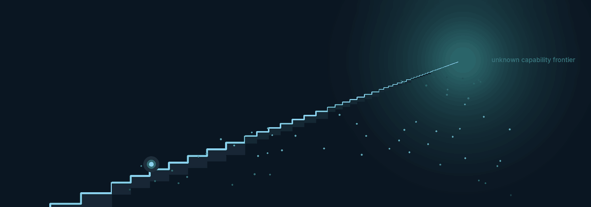
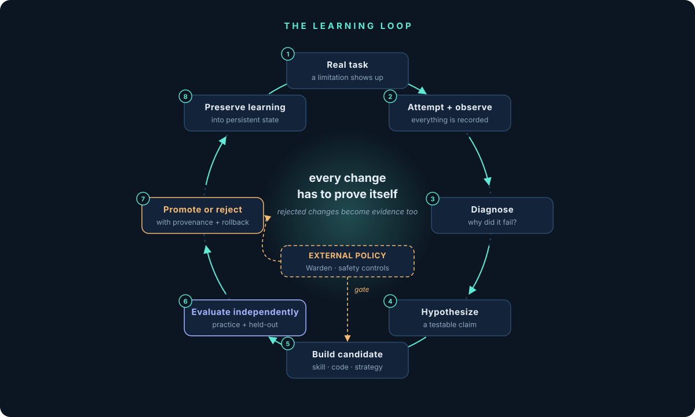
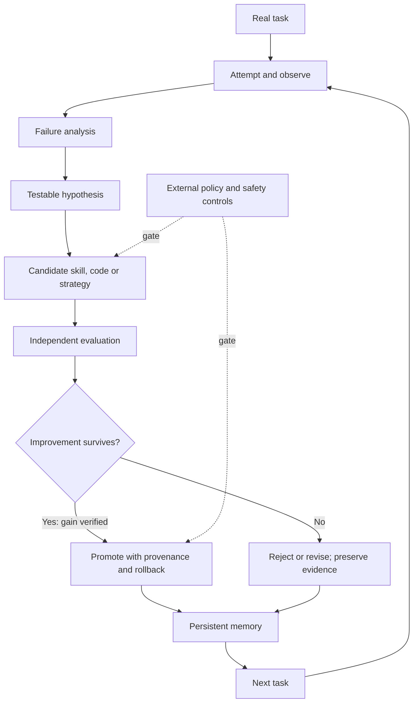
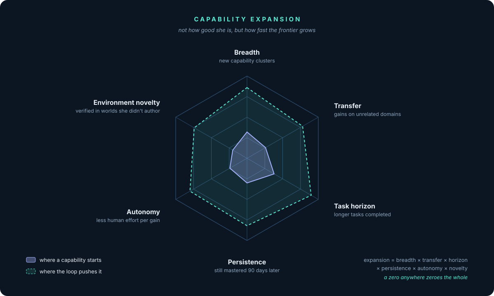
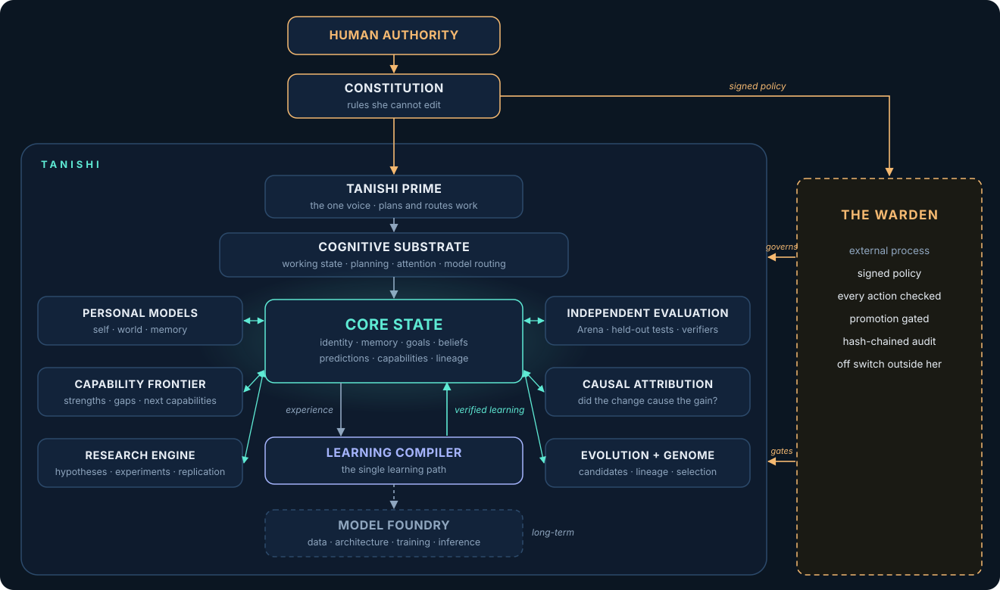
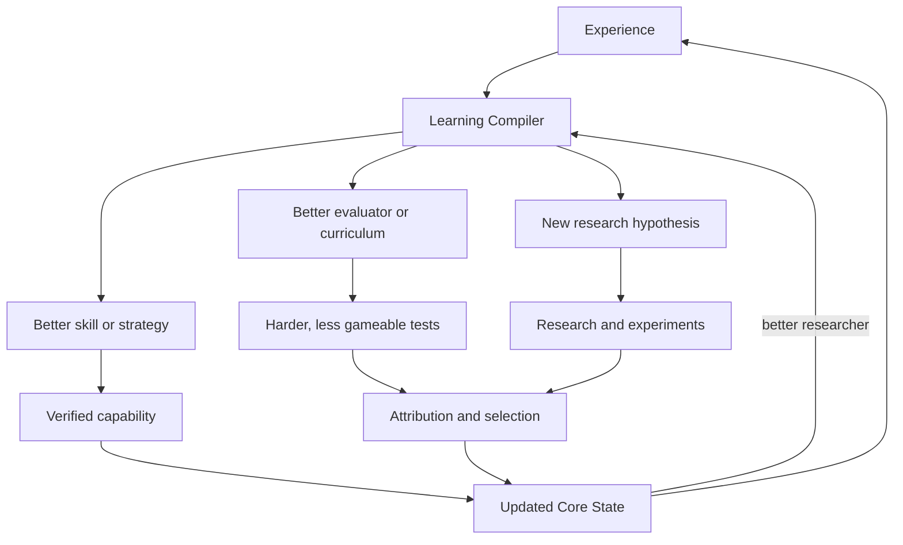

<p align="center">
  
</p>

<h1 align="center">Tanishi</h1>

<p align="center">
  <strong>A personal intelligence that learns from living with you — and learns how to learn better.</strong>
</p>

<p align="center">
  <a href="#the-question">The question</a> ·
  <a href="#the-loop">The loop</a> ·
  <a href="#the-long-horizon">The long horizon</a> ·
  <a href="#architecture">Architecture</a> ·
  <a href="#evidence-over-mythology">Evidence</a> ·
  <a href="#safety-and-control">Safety</a> ·
  <a href="#quickstart">Quickstart</a>
</p>

<p align="center">
  
  
  
</p>

---

## The question

> **What if an AI didn't just learn to help you — but learned how to become more capable at helping you?**

We're building **Tanishi**, a personal AI designed to live with you: to remember context, understand your goals, work across your tools, and become more useful through experience.

But the personal assistant is the beginning, not the final ambition.

Most AI systems depend on people to close the improvement loop. When an agent fails, someone diagnoses the failure, changes the prompt or code, adds a test, and tries again. Tanishi is an attempt to move more of that work into a system that can **observe its limitations, investigate them, develop candidate improvements, and prove whether those improvements work**.

The long-term research question is more ambitious still:

**Can an intelligence learn how to improve the process by which it learns — and repeatedly discover useful capabilities that nobody explicitly specified in advance?**

That is the staircase.

We are not claiming that the destination has been reached. We're building the foundations, tests, and experiments that let us find out how far the idea can go.

## Two things, one system

<table>
  <tr>
    <td width="50%" valign="top">
      <h3>01 / The companion</h3>
      An AI that lives with you. Persistent memory, personal context, planning, tools, and continuity across the work you're doing.
      <br/><br/>
      <strong>The promise:</strong> you spend less time repeating yourself and more time moving your life and work forward.
    </td>
    <td width="50%" valign="top">
      <h3>02 / The learning engine</h3>
      A system that turns experience into testable knowledge, reusable skills, better evaluations, new hypotheses, and candidate improvements.
      <br/><br/>
      <strong>The question:</strong> can those verified improvements compound, while human effort per improvement falls?
    </td>
  </tr>
</table>

The companion makes Tanishi useful. The learning engine is what makes the research unusual.

## The loop

A model saying *"I've improved"* isn't evidence. A higher score on one familiar test isn't enough either.

The loop we want is concrete:

<p align="center">
  
</p>



A change counts only when it survives appropriate tests, does not create unacceptable regressions, and — where the claim requires it — transfers to tasks it was not tuned against. Rejected changes are useful too: they become evidence about what did not work and why.

## The long horizon

The far-end vision is not just a smarter chat window. It is a persistent intelligence that can use experience to expand what it can reliably do, improve its research process, and help us build better tools for discovery.

<p align="center">
  
</p>

If this works, the same learning loop could eventually support:

- **Scientific acceleration:** generating hypotheses, choosing experiments, analyzing results, and learning from negative results.
- **Better engineering systems:** improving code, tools, agent workflows, evaluators, and the infrastructure that supports research.
- **New capability discovery:** finding useful skills or problem-solving methods that weren't explicitly listed as goals in advance.
- **Physical-world research:** moving carefully from simulations to validated, instrumented experiments and appropriately controlled robotics or laboratory systems.
- **Recursive improvement research:** improving not only task performance, but the machinery that discovers, tests, and preserves improvements.

These are research directions, not a claim that each capability already exists in Tanishi. Each step needs its own evidence and authorization.

## Architecture

The system is organized around a persistent shared state and a single learning path. The goal is for different research mechanisms to compound rather than operate as disconnected demos.

<p align="center">
  
</p>

### Core components

| Component | Why it exists |
|---|---|
| **Core State** | A versioned home for identity, memory, goals, beliefs, predictions, capabilities, and lineage. |
| **Cognitive Substrate** | The machinery of thought: working state, planning, attention, model routing, and memory access. Foundation models are components Tanishi uses, not the entirety of her identity. |
| **Learning Compiler** | Turns experience into candidate beliefs, tested skills, training examples, curriculum, evaluators, and improvement hypotheses. |
| **Capability Frontier** | Tracks strengths, gaps, uncertainty, failure patterns, and promising next capabilities. |
| **Hypothesis and Research Engine** | Converts questions into hypotheses, experiments, analysis, and attempts at replication. |
| **Arena** | Separates visible practice from harder or held-out evaluation, making it harder to optimize for a familiar test. |
| **Verifier Discovery** | Investigates how to evaluate tasks that do not have a reliable off-the-shelf grader. |
| **Causal Attribution** | Asks whether a change caused the gain, rather than merely appearing alongside it. |
| **Evolution and Intelligence Genome** | Preserves candidate versions and lineage; compares what each change gained, lost, and cost. |
| **Model Foundry** | The longer-term direction for joint exploration of data, architecture, training, post-training, inference, and eventually hardware. |

### The recursive staircase



This is the compounding loop we're trying to establish. The important milestone is not that the diagram runs in a document. It is that one real task can pass through the loop end-to-end and the next relevant task benefits from what was learned.

## Evidence over mythology

Tanishi has a large long-term architecture, but a README should make it easy to tell the difference between **what is implemented, what is being built, and what remains a hypothesis**.

The current project snapshot reports the following foundations and capabilities:

- **Core State:** append-only event history, evidence-bearing beliefs, goals, prediction records, lineage, snapshots, and continuity checks.
- **Arena:** structured task format, runner, and practice evaluation foundations.
- **Cognitive Substrate:** working state, planning, and goal state.
- **Observability:** experiment records, human-effort tracking, core metrics, and attribution infrastructure.
- **Warden:** a separate policy-enforcement process intended to check actions against signed policy and record an audit trail.
- **Learning from failure:** retrospectives that can inform later attempts.
- **Reusable skills:** successful multi-step runs can be distilled into procedural skills.
- **Memory consolidation:** nightly and weekly consolidation into compact long-term knowledge.
- **Local-first operation:** provider routing including local models and a strict offline mode.
- **Interfaces and tools:** CLI, dashboard, API, Telegram, voice, and MCP-connected tools as described by the current project configuration.

### One reported autoresearch run

The current project notes record one local run with:

| Measure | Reported result |
|---|---:|
| Experiments attempted | 142 |
| Changes retained | 5 |
| Composite score change | +16.29% |
| Human interventions during that run | 0 |

These numbers describe a particular run, not proof of general recursive self-improvement. To interpret them, inspect the benchmark definition, baseline, retained-change artifacts, compute cost, regression tests, and reproduction procedure in [`tanishi/autoresearch/`](tanishi/autoresearch/). Update this table only when the underlying run record supports the claim.

### The first important gate

Close one complete loop:

1. A real task exposes a limitation.
2. Tanishi diagnoses the failure and states a testable hypothesis.
3. It creates a new skill or other bounded candidate change.
4. An independent evaluator tests it on practice and held-out cases.
5. The change beats noise, passes regression checks, and can be rolled back.
6. The verified result enters persistent state.
7. A later task benefits without a human manually performing the missing step.

That will be more meaningful than a hundred disconnected modules or a thousand unverified experiments.

## Safety and control are part of the design

The target is not autonomy at any cost. A system that gains capability faster than we can evaluate and govern it is not a successful outcome.

The principles we are building toward:

1. **Human authority remains external.** The system does not grant itself permissions or redefine its own approval process.
2. **Every consequential change has provenance.** Record what changed, why, what it touched, how it was tested, and how to revert it.
3. **The candidate is not its own examiner.** Independent evaluation and protected test sets gate promotion.
4. **Autonomy expands by evidence.** A successful benchmark does not imply unrestricted access to the network, finances, physical equipment, or production systems.
5. **Containment does not depend on cooperation.** Revocation, quotas, shutdown, and recovery must remain enforceable outside the process being controlled.
6. **Personal context stays personal.** Reusable general capabilities may be shared with appropriate controls; one person's private memories should not become another person's memory.
7. **Unexpected changes trigger investigation.** A surprising capability jump, missing audit record, or weakened safeguard blocks promotion until understood.

The Warden is designed as a separate enforcement process. Its existence is not a substitute for testing whether policies, logs, isolation, rollback, and the off switch actually work.

## Roadmap

| Tier | Focus | Status in the current project snapshot |
|---|---|---|
| **T0 · Foundation** | Core State, Arena, Cognitive Substrate, observability, Warden | In progress; snapshot reports 18 of 28 nodes merged |
| **T1 · Learning** | Learning Compiler, contradiction-aware knowledge, skills with tests, curriculum from failure | Next stage |
| **T2 · Self-improvement** | Evolution archive, causal attribution, capability graph, unknown/verifier discovery | Planned research tier |
| **T3 · Research** | Hypothesis and experiment engines, simulation, self-play, research strategy | Planned research tier |
| **T4 · Meta** | Self-extensible learning, joint search over architecture and training, model/inference research | Long-term research tier |

Treat this table as a dated snapshot, not a live CI status. Update it as the build graph changes.

## Quickstart

> Commands below reflect the current repository setup. Check `.env.example` and `pyproject.toml` for the exact dependencies and provider configuration.

```bash
git clone https://github.com/Jyotiraditya0709/tanishi-ai.git
cd tanishi-ai
python -m venv .venv
source .venv/bin/activate
pip install -e .
cp .env.example .env
python -m tanishi.cli
```

Python 3.11+ is required by the current setup. Configure an [Anthropic API key](https://console.anthropic.com/) for Claude-backed reasoning, and/or [Ollama](https://ollama.com/) for local-model use. For strict offline mode, set `TANISHI_OFFLINE=1` and verify the selected feature is supported offline.

Run the test suite:

```bash
python -m pytest -q
```

Never commit API keys. Review permissions before connecting tools that can access email, finance, browsers, shell commands, or other consequential actions.

## Research that informs the work

Tanishi draws from multiple research directions. These works inform individual mechanisms; they do not establish that Tanishi itself has achieved the same capabilities.

- [Darwin Gödel Machine](https://arxiv.org/abs/2505.22954) — empirically evaluated iterative self-modification for coding agents.
- [AlphaEvolve](https://deepmind.google/blog/alphaevolve-a-gemini-powered-coding-agent-for-designing-advanced-algorithms/) — generate and evaluate algorithm candidates with automated scoring.
- [SEAL: Self-Adapting Language Models](https://arxiv.org/abs/2506.10943) — model-generated self-edits for persistent adaptation.
- [Reflexion](https://arxiv.org/abs/2303.11366) — use feedback stored in memory to improve subsequent attempts.
- [MAP-Elites](https://arxiv.org/abs/1504.04909) — preserve diverse high-performing candidates rather than one winner.
- [METR time horizons](https://metr.org/time-horizons/) — evaluate the length and difficulty of tasks AI agents can complete reliably.

The question is whether mechanisms like these can be connected through one persistent learning system so their outputs compound.

## Get involved

The most useful contribution is one that makes the idea more testable.

- **Build:** help close the first complete task-to-verified-skill loop.
- **Break:** find evaluation leakage, unreliable gains, memory poisoning, weak isolation, or rollback failures.
- **Research:** propose an experiment that could falsify a core assumption.
- **Review:** challenge the metrics, architecture, and safety boundaries.

Start with the [repository](https://github.com/Jyotiraditya0709/tanishi-ai), open an [issue](https://github.com/Jyotiraditya0709/tanishi-ai/issues), or follow [Jyotiraditya](https://github.com/Jyotiraditya0709).

## The end we are working toward

Today, Tanishi begins as a personal intelligence: one that remembers, helps, and learns from experience.

The long horizon is an intelligence that can discover capabilities its creators did not explicitly list, build better ways to test those capabilities, accelerate scientific and engineering work, and improve the machinery that produces the next improvement.

Not a claim that we already know how to get there. A question worth building toward, with evidence at every step.

<p align="center">
  <strong>One intelligence. A growing frontier. Every improvement has to prove itself.</strong>
</p>

<p align="center">
  <a href="https://github.com/Jyotiraditya0709/tanishi-ai">Explore the repository</a> ·
  <a href="https://github.com/Jyotiraditya0709/tanishi-ai/issues">Challenge the work</a> ·
  <a href="https://github.com/Jyotiraditya0709">Follow the journey</a>
</p>
